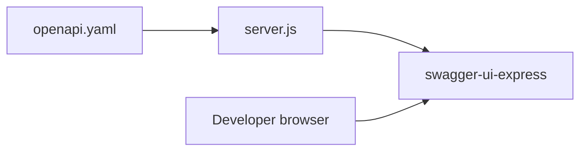

# API documentation (Swagger-style)

## Recommendation

| Approach                                                    | When to use                                                                                                                                |
| ----------------------------------------------------------- | ------------------------------------------------------------------------------------------------------------------------------------------ |
| **OpenAPI 3 YAML/JSON + Swagger UI** (`swagger-ui-express`) | **Recommended here.** One canonical spec in git, reviewable diffs, works with Postman/Insomnia import, matches “Swagger API” expectations. |
| **swagger-jsdoc**                                           | Spec generated from JSDoc on routes; convenient for tiny APIs but **drifts** from real behavior unless every change updates comments.      |
| **Scalar** (`@scalar/express-api-reference`)                | Same OpenAPI file; **nicer UI** than default Swagger UI. Optional swap later without changing the spec.                                    |

**Correct “Swagger” stack for you:** maintain **[OpenAPI 3](https://swagger.io/specification/)** as the contract, serve **[Swagger UI](https://github.com/scottie1984/swagger-ui-express)** at a stable path (e.g. `GET /api-docs`). That is what most teams mean by “Swagger documentation.”

## Scope (document what exists today)

Mount points from [backend/src/server.js](backend/src/server.js):

- `GET /`, `GET /health/db`, `GET /api/meta` and `GET /v1/meta`
- Under **`/api`** and mirrored **`/v1`**: `deities`, `deities/:slug`, nested `.../slokas|temples|avatars|festivals`, plus `slokas`, `temples`, `avatars`, `songs`, `festivals`, `mythical-beings`, `mythical-beings/:slug`

**Spec strategy:** document the **`/api`** surface as primary (paths like `/deities`, server `url: http://localhost:5000/api` **or** server root + paths `/api/deities` — pick one style and stay consistent). Add a short `description` noting **`/v1` is an alias** so readers are not confused.

**Schemas:** reuse the real response shape `{ success, data, meta? }` from [backend/src/utils/apiResponse.js](backend/src/utils/apiResponse.js); define `Deity`, `Sloka`, `Temple`, etc. as components (subset of fields is fine initially; expand as you harden contracts).

## Implementation steps

1. **Dependencies** ([backend/package.json](backend/package.json)): add `swagger-ui-express` and `js-yaml` (or `yaml`) to parse the spec once at startup.
2. **Spec file:** add [backend/docs/openapi.yaml](backend/docs/openapi.yaml) (or `backend/openapi/openapi.yaml`) with `openapi: 3.0.3`, `info` (title, version, description), `servers`, `paths` for all routes above, `components.schemas` for shared envelopes and entities.
3. **Wire UI** in [backend/src/server.js](backend/src/server.js): read YAML from disk, `YAML.load`, `app.use("/api-docs", swaggerUi.serve, swaggerUi.setup(spec, { explorer: true }))`. Optionally `GET /openapi.json` to expose the resolved JSON for tooling.
4. **CORS:** already global; no change unless you host UI on another origin (then add that origin or document same-origin only).
5. **Docs for humans:** one paragraph in [backend/README.md](backend/README.md) — “Open API docs at http://localhost:5000/api-docs” and how to refresh the YAML when adding routes.
6. **Optional (later):** `spectral` or `@redocly/cli` lint in CI; Scalar instead of Swagger UI — not required for the first slice.

## Plan file / todos (what you asked to append)

After this plan is approved, **append** to [.cursor/plans/roadmap_next_steps_d5ceeff7.plan.md](.cursor/plans/roadmap_next_steps_d5ceeff7.plan.md):

- A short section **“API documentation (OpenAPI / Swagger)”** summarizing the above and linking to `backend/docs/openapi.yaml` and `/api-docs`.
- New frontmatter todos (all `pending` until done):
  - `docs-openapi-spec` — Author `openapi.yaml` covering all current `/api` routes + schemas.
  - `docs-swagger-ui` — Mount Swagger UI + optional `/openapi.json` in `server.js`.
  - `docs-readme` — README pointer for developers.

(Optionally refresh the outdated “Current baseline” paragraph in that plan that still mentions JSON-backed deities — purely editorial.)

## Suggested git slice

Single PR `docs/openapi-swagger-ui` + tag optional `v0.0.1-docs` if you version documentation separately from features.
