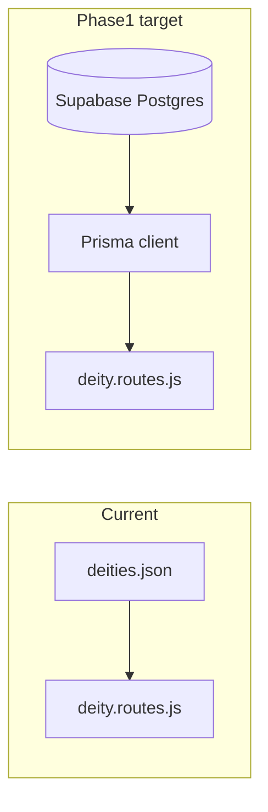

# Roadmap-aligned execution plan

Current baseline: [backend/src/server.js](backend/src/server.js) + Prisma datasource with `DATABASE_URL` / `DIRECT_URL`; [backend/prisma/schema.prisma](backend/prisma/schema.prisma) defines `Deity`; [backend/src/routes/deity.routes.js](backend/src/routes/deity.routes.js) still serves [backend/src/data/deities.json](backend/src/data/deities.json). Frontend expects list as array and detail as `{ success, data }` ([frontend/src/pages/Home.jsx](frontend/src/pages/Home.jsx), [frontend/src/pages/DeityDetail.jsx](frontend/src/pages/DeityDetail.jsx)).



---

## Phase 0 – Proof of Concept (close-out)

Roadmap DoD: API local, React consumes API, **Supabase connected**.

| Task                                     | Notes                                                                                                                                                     |
| ---------------------------------------- | --------------------------------------------------------------------------------------------------------------------------------------------------------- |
| Mark Phase 0 done                        | Supabase + `prisma db push` satisfied “connected”; optional: add `GET /health/db` to roadmap checklist in your head only (no doc change unless you want). |
| Smoke-test frontend                      | `VITE_API_BASE_URL` must include `/api` so list hits `/api/deities`.                                                                                      |
| Fix small UI bugs when touching frontend | [DeityDetail.jsx](frontend/src/pages/DeityDetail.jsx): unreachable `activeTab === "media"` vs tab buttons; 404 handling for failed slug fetch.            |

---

## Phase 1 – Core Deity API (next major chunk)

**Goal:** Stable `/deities` and `/deities/{slug}` backed by DB, clean schema, consistent JSON.

| Task                        | Notes                                                                                                                                                                                                                                                                   |
| --------------------------- | ----------------------------------------------------------------------------------------------------------------------------------------------------------------------------------------------------------------------------------------------------------------------- |
| Expand Prisma `Deity` model | Add roadmap fields: **aliases** (e.g. `String[]` or JSON), **affiliation**, **abode**; align naming with API (`aliases` vs `alternateNames` — pick one public contract and map). Decide fate of `type` / `era` vs current JSON `category` (rename or map in API layer). |
| Migrations vs `db push`     | Prefer `prisma migrate dev` for repeatable history once schema stabilizes ([backend/package.json](backend/package.json) already has `db:migrate`).                                                                                                                      |
| Seed script                 | `prisma/seed.js` (or `tsx`) importing from existing JSON or hand-authored rows for **Shiva, Vishnu, Devi** per roadmap; wire `"prisma": { "seed": "..." }` in package.json.                                                                                             |
| Replace JSON in routes      | Use [backend/src/db/prisma.js](backend/src/db/prisma.js): `findMany` / `findUnique` by `slug`; handle 404.                                                                                                                                                              |
| Unify response envelope     | Roadmap: “proper JSON” — e.g. always `{ success, data }` for list + detail, or document breaking change and update frontend once.                                                                                                                                       |
| Versioning (optional)       | Roadmap mentions `/v1` in [backend/README.md](backend/README.md); code uses `/api/deities`. Either add `/v1/deities` alias or update README to match reality.                                                                                                           |

**Definition of done:** Shiva/Vishnu/Devi retrievable from DB; frontend works without relying on JSON file; schema documents core fields.

---

## Phase 2 – Slokas and Mantras

| Task                | Notes                                                                                              |
| ------------------- | -------------------------------------------------------------------------------------------------- |
| Prisma models       | `Sloka` (or `Mantra`) with `sanskrit`, `transliteration`, `meaning`, FK `deityId`.                 |
| Routes              | `GET /api/slokas`, `GET /api/deities/:slug/slokas` (or `/v1/...` if you standardize versioning).   |
| Seed                | 2–3 slokas per deity, linked by FK.                                                                |
| Frontend (optional) | Wire existing tabs in DeityDetail to new endpoint or embed in deity payload (choose one contract). |

---

## Phase 3 – Temples

| Task                  | Notes                                                                                               |
| --------------------- | --------------------------------------------------------------------------------------------------- |
| Prisma `Temple` model | `name`, `location`, `significance`, relation to `Deity` (many-to-many or `deityId` if one primary). |
| Routes                | `GET /api/temples`, `GET /api/deities/:slug/temples`.                                               |
| Geolocation           | Add `lat`/`lng` optional columns; validate ranges in service or Zod later.                          |
| Seed                  | At least 2 temples per deity (roadmap).                                                             |

---

## Phase 4 – Avatars / Forms

| Task                            | Notes                                                                               |
| ------------------------------- | ----------------------------------------------------------------------------------- |
| Model `Avatar` (or `DeityForm`) | Link to deity; fields for name, description, tradition (Dashavatara / Shiva forms). |
| Routes                          | `GET /api/avatars`, `GET /api/deities/:slug/avatars`.                               |
| Seed                            | Start with Vishnu Dashavatara + a few Shiva forms.                                  |

---

## Phase 5 – Songs / Stotrams

| Task                | Notes                                                                                                             |
| ------------------- | ----------------------------------------------------------------------------------------------------------------- |
| Model metadata-only | Title, artist/credit, URL to external legal source, license note — **no hosted copyrighted audio** (per roadmap). |
| Route               | `GET /api/songs` (+ optional filters later).                                                                      |

---

## Phase 6 – Festivals

| Task                                   | Notes                                                     |
| -------------------------------------- | --------------------------------------------------------- |
| Model `Festival` + relation to deities |                                                           |
| Routes                                 | `GET /api/festivals`, `GET /api/deities/:slug/festivals`. |

---

## Phase 7 – Multilingual

| Task   | Notes                                                                                                |
| ------ | ---------------------------------------------------------------------------------------------------- |
| Schema | e.g. `descriptionEn`, `descriptionTa` or JSON map `descriptions` by locale.                          |
| API    | `Accept-Language` or `?lang=` — pick one pattern and apply to deity (then slokas/temples as needed). |

---

## Phase 8 – Media

| Task             | Notes                                                                    |
| ---------------- | ------------------------------------------------------------------------ |
| Supabase Storage | Buckets for deity images; store public path or signed URL policy in DB.  |
| API              | Image URLs on deity/media endpoints; align with roadmap “image support”. |

---

## Phase 9 – Search, filtering, pagination

| Task         | Notes                                                                    |
| ------------ | ------------------------------------------------------------------------ |
| Query params | `q`, `category`, `page`, `limit` on list endpoints.                      |
| Prisma       | `where` + `skip`/`take`; consider DB indexes on `slug`, searchable text. |

---

## Phase 10 – Extended mythology

| Task             | Notes                                                                                                        |
| ---------------- | ------------------------------------------------------------------------------------------------------------ |
| New entity types | Mythical beings, Asuras, Yakshas, Nagas — separate tables + `GET` collections and optional links to deities. |

---

## Cross-cutting (throughout)

- **Validation:** lightweight middleware (e.g. Zod) for params/query before Phase 9 gets complex.
- **Errors:** consistent `{ success: false, message, code? }` for 4xx/5xx.
- **Env / deploy:** keep `DATABASE_URL` (pooler) + `DIRECT_URL` (session/direct) pattern for CI migrations.

---

## Suggested order of execution

1. Finish **Phase 0** smoke tests + tiny frontend fixes.
2. **Phase 1** end-to-end (schema + migrate + seed + Prisma routes + response contract + frontend alignment).
3. Proceed **Phase 2 → 3** in order (slokas then temples) since roadmap and UI tabs already anticipate them.
4. Phases **4–6** as parallel schema work is manageable; **7–10** when you need those product surfaces.

No open questions are blocking this plan; optional later choice is **`/api` vs `/v1`** prefix — decide in Phase 1 when you stabilize public URLs.

---

## Git strategy (branches, PRs, tags)

**Goals:** each merge to `main` stays shippable; **tags** mark roadmap checkpoints; **PRs** stay small enough to review without mixing unrelated phases.

### Tag map (pre-1.0, aligned to phases)

Use **annotated tags** on `main` after the listed work merges. Patch bumps (`v0.3.1`) are for fixes only, not new roadmap scope.

| Tag (example) | After roadmap phase | What it represents                                                                                                        |
| ------------- | ------------------- | ------------------------------------------------------------------------------------------------------------------------- |
| `v0.0.0`      | Phase 0 closed      | POC stable — API + React + Supabase connectivity; optional tiny frontend fixes merged                                     |
| `v0.1.0`      | Phase 1 done        | Core Deity API from DB — schema, migrations, seed (Shiva/Vishnu/Devi), Prisma routes, response contract, frontend aligned |
| `v0.2.0`      | Phase 2 done        | Slokas and mantras endpoints + seeded links                                                                               |
| `v0.3.0`      | Phase 3 done        | Temples + geo fields + seed                                                                                               |
| `v0.4.0`      | Phase 4 done        | Avatars / forms                                                                                                           |
| `v0.5.0`      | Phase 5 done        | Song metadata API                                                                                                         |
| `v0.6.0`      | Phase 6 done        | Festivals                                                                                                                 |
| `v0.7.0`      | Phase 7 done        | EN + TA descriptions in API                                                                                               |
| `v0.8.0`      | Phase 8 done        | Media + Supabase Storage                                                                                                  |
| `v0.9.0`      | Phase 9 done        | Search, filter, pagination                                                                                                |
| `v0.10.0`     | Phase 10 done       | Extended mythology entities                                                                                               |

If you prefer fewer tags early on, tag only **even phases** or only **minor** milestones — but consistent `v0.N.0` ↔ phase N is easy to remember.

### Logical PRs (recommended splits)

Branch from `main`; open one PR per row; merge in order within a phase.

**Phase 0 (optional cleanup)**

| PR   | Branch example         | Contents                                                                                           |
| ---- | ---------------------- | -------------------------------------------------------------------------------------------------- |
| P0-a | `fix/web-phase0-smoke` | DeityDetail 404 + dead tab; README/env notes if needed; manual smoke only — no API contract change |

**Phase 1 (DB-backed deities — split to keep diffs small)**

| PR              | Branch example             | Contents                                                                                                                |
| --------------- | -------------------------- | ----------------------------------------------------------------------------------------------------------------------- |
| P1-a            | `feat/db-deity-schema`     | Prisma model extensions (aliases, affiliation, abode, category alignment); **migration files** only + `prisma generate` |
| P1-b            | `chore/db-seed-deities`    | `prisma/seed` + `package.json` seed script; Shiva/Vishnu/Devi data                                                      |
| P1-c            | `feat/api-deities-prisma`  | Replace JSON reads with Prisma in routes; unified JSON envelope; **frontend** updates for list/detail                   |
| P1-d (optional) | `chore/api-version-prefix` | `/v1` alias or README alignment                                                                                         |

Tag **`v0.1.0`** on `main` after P1-c (and P1-d if you do it) are merged.

**Phases 2–10 (one phase = one or two PRs)**

| Phase | Suggested branches                                                                            | Tag after merge |
| ----- | --------------------------------------------------------------------------------------------- | --------------- |
| 2     | `feat/slokas-schema-migrate`, then `feat/slokas-routes-seed` (or single `feat/phase2-slokas`) | `v0.2.0`        |
| 3     | `feat/phase3-temples` (split schema vs routes if large)                                       | `v0.3.0`        |
| 4     | `feat/phase4-avatars`                                                                         | `v0.4.0`        |
| 5     | `feat/phase5-songs`                                                                           | `v0.5.0`        |
| 6     | `feat/phase6-festivals`                                                                       | `v0.6.0`        |
| 7     | `feat/phase7-i18n`                                                                            | `v0.7.0`        |
| 8     | `feat/phase8-media-storage`                                                                   | `v0.8.0`        |
| 9     | `feat/phase9-search-pagination`                                                               | `v0.9.0`        |
| 10    | `feat/phase10-extended-mythology`                                                             | `v0.10.0`       |

### Commits inside a PR

- Keep commits **logical and sequential** (schema before routes that depend on it).
- Optional [Conventional Commits](https://www.conventionalcommits.org/): `feat(api):`, `fix(web):`, `chore(db):`, `docs:`.
- Avoid mixing generated noise ( huge lockfile-only ) with feature commits unless unavoidable.

### Changelog

At each **tag**, add a section to [CHANGELOG.md](CHANGELOG.md) (Keep a Changelog: `## [v0.1.0]` — Added / Changed) summarizing merged PRs since the previous tag.

### Commands (reference only)

```bash
git checkout main && git pull
git checkout -b feat/db-deity-schema
# ... work, commit ...
git push -u origin feat/db-deity-schema
# merge via PR on GitHub/GitLab, then:
git checkout main && git pull
git tag -a v0.1.0 -m "Phase 1: core deity API from database"
git push origin v0.1.0
```
