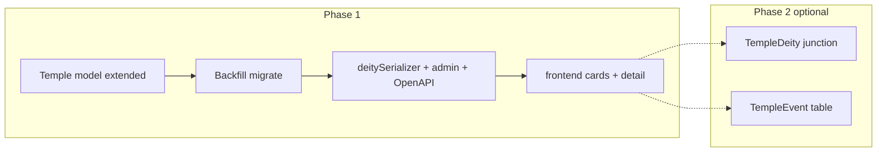

# Temple table redesign (Prisma + API)

## Current state

[`backend/prisma/schema.prisma`](backend/prisma/schema.prisma) `Temple` today:

- `id` (UUID), `deityId` (required FK → `Deity`), `name`, `location`, `significance?`, `latitude?`, `longitude?`, timestamps.

Used by: [`deity.routes.js`](backend/src/routes/deity.routes.js) (include on deity detail + `GET /deities/:slug/temples`), [`temple.routes.js`](backend/src/routes/temple.routes.js) (list all), [`deitySerializer.js`](backend/src/utils/deitySerializer.js) (maps DB rows → `worship.temples` on public deity JSON), [`admin.routes.js`](backend/src/routes/admin.routes.js) + [`docs/samples/temples.sample.csv`](backend/docs/samples/temples.sample.csv), [`docs/openapi.yaml`](backend/docs/openapi.yaml) `Temple` / `TempleWithDeity`, seed [`backend/prisma/seed.js`](backend/prisma/seed.js), frontend list/detail via [`frontend/src/config/explore.js`](frontend/src/config/explore.js) + [`RecordDetail.jsx`](frontend/src/pages/RecordDetail.jsx) + deity page [`DeityDetail.jsx`](frontend/src/pages/DeityDetail.jsx).

## Target logical model (mapped to Prisma/Postgres)

| Your concept          | Suggested Prisma field                    | Type / notes                                                                                                                                                                                                                                                                                                                                                 |
| --------------------- | ----------------------------------------- | ------------------------------------------------------------------------------------------------------------------------------------------------------------------------------------------------------------------------------------------------------------------------------------------------------------------------------------------------------------ |
| Primary key           | **Keep `id String @id @default(uuid())`** | Avoids breaking existing `/temples/:id` URLs and FK churn. If you truly need an integer display key, add optional `legacyNumber Int? @unique` later—not required for data model. (Your `INT AUTO_INCREMENT` is MySQL-style; Postgres uses `SERIAL`/`IDENTITY`; Prisma `Int @id @default(autoincrement())` would replace UUID and force a heavier migration.) |
| temple_name_tamil     | `nameTamil`                               | `String?` (use `@db.VarChar(255)` if you want strict length)                                                                                                                                                                                                                                                                                                 |
| temple_name_english   | `nameEnglish`                             | `String` (required at DB level once migrated)                                                                                                                                                                                                                                                                                                                |
| location_city         | `city`                                    | `String`                                                                                                                                                                                                                                                                                                                                                     |
| overview              | `overview`                                | `@db.Text`                                                                                                                                                                                                                                                                                                                                                   |
| sthala_puranam        | `sthalaPuranam`                           | `@db.Text`                                                                                                                                                                                                                                                                                                                                                   |
| literary_background   | `literaryBackground`                      | `@db.Text`                                                                                                                                                                                                                                                                                                                                                   |
| purana_background     | `puranaBackground`                        | `@db.Text`                                                                                                                                                                                                                                                                                                                                                   |
| deities (list text)   | `deitiesText`                             | `@db.Text` — avoids clashing with relation name `deity`                                                                                                                                                                                                                                                                                                      |
| pooja_timings         | `poojaTimings`                            | `@db.Text`                                                                                                                                                                                                                                                                                                                                                   |
| festivals_events      | `festivalsEvents`                         | `@db.Text`                                                                                                                                                                                                                                                                                                                                                   |
| specialities          | `specialities`                            | `@db.Text`                                                                                                                                                                                                                                                                                                                                                   |
| how_to_reach          | `howToReach`                              | `@db.Text`                                                                                                                                                                                                                                                                                                                                                   |
| temple_contact_info   | `contactInfo`                             | `@db.Text`                                                                                                                                                                                                                                                                                                                                                   |
| image_gallery_urls    | `imageGalleryUrls`                        | `Json?` — Prisma `Json` for `string[]` or `{ url, caption? }[]`                                                                                                                                                                                                                                                                                              |
| (existing) lat/lon    | `latitude`, `longitude`                   | keep optional `Float?`                                                                                                                                                                                                                                                                                                                                       |
| **Deity association** | `deityId`                                 | **Recommend `String?` (nullable)** after migration: supports standalone temple records (Meenakshi-level) while preserving current “temple under one deity” UX. Admin/import should accept optional `deity_slug`.                                                                                                                                             |

**Deprecation / migration mapping from old columns**

- `name` → `nameEnglish` (backfill), then drop `name` (or keep temporarily with `@map` only during transition—prefer single migrate step).
- `location` → `city`.
- `significance` → `overview` (best-effort; seed data was generic “Major pilgrimage site”).

## Normalization (optional second phase)

Your note about querying by god/month: **do not block Phase 1**. If needed later:

- `TempleDeity` (`templeId`, `deityId`, `role?`) many-to-many, and/or `TempleEvent` (`templeId`, `name`, `month`, `description`).

Phase 1 keeps a single optional `deityId` + narrative `deitiesText` for Excel parity.

## Implementation steps (after plan approval)

1. **Prisma schema** — Replace `Temple` fields with the new set above; set `deityId` optional; index `deityId`, optionally `city` for filters.
2. **SQL migration** — `prisma migrate dev` (or `db push` in dev): add new columns, backfill from old columns, drop old columns (`name`, `location`, `significance`), alter `deityId` to nullable (Postgres `ALTER COLUMN ... DROP NOT NULL`).
3. **Seed** — Update [`backend/prisma/seed.js`](backend/prisma/seed.js) `templeRows` to populate `nameEnglish`, `city`, `overview`, etc., and keep `deityId` where applicable.
4. **deitySerializer** — Update [`deitySerializer.js`](backend/src/utils/deitySerializer.js) `dbTemples` mapping: public objects should expose stable keys for the app (e.g. `name` = `nameEnglish` for backward compat **or** bump to `nameEnglish` / `nameTamil` / `city` explicitly—pick one and align frontend).
5. **Admin** — [`admin.routes.js`](backend/src/routes/admin.routes.js) temple create/import: accept new JSON/CSV columns; map legacy `name`/`location` if you want short-term compatibility; relax “deity required” when `deityId` nullable.
6. **Sample CSV** — [`backend/docs/samples/temples.sample.csv`](backend/docs/samples/temples.sample.csv) + [`adminHtml.js`](backend/src/utils/adminHtml.js) temple form fields.
7. **OpenAPI** — Expand [`docs/openapi.yaml`](backend/docs/openapi.yaml) `Temple` / `TempleWithDeity` schemas.
8. **Frontend** — [`explore.js`](frontend/src/config/explore.js) `toCard` (titles/subtitles from `nameEnglish` / `city`), [`DeityDetail.jsx`](frontend/src/pages/DeityDetail.jsx) temple lines, [`RecordDetail.jsx`](frontend/src/pages/RecordDetail.jsx) will show new keys automatically via generic `dl` list (verify large TEXT not harming UX).

## Risk / testing checklist

- Nullable `deityId`: `GET /deities/:slug/temples` should return only linked temples; list `GET /api/temples` returns all including unlinked.
- Large Tamil `TEXT`: Postgres `TEXT` is fine; Prisma `@db.Text` for all long fields.
- JSON gallery: validate array shape on admin import (string JSON column in CSV).

